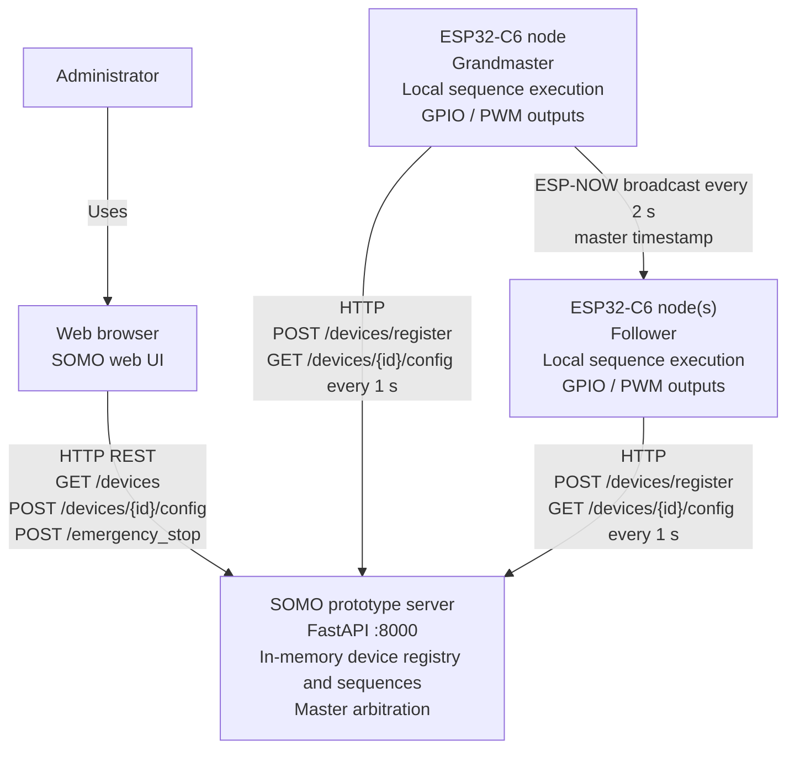

# SOMO — Architecture & API Reference

## System Overview

SOMO is a distributed edge-control system. Multiple **ESP32-C6 nodes** execute synchronized digital and PWM output sequences locally. A central **Python/FastAPI server** serves the browser UI, keeps device and sequence state in memory, and assigns the Grandmaster role. Nodes obtain their configuration through HTTP polling and synchronize clocks directly through ESP-NOW; the server is not part of the clock-sync data path.

### System Context Diagram



The ESP32 firmware applies the downloaded sequence locally using a double buffer. The server's response to each config poll includes the current `is_master` role and `master_channel`; it does not send execution commands or clock-sync frames to devices.

### Design Pattern
The server acts as a **central configuration store with per-device state**:

- ESP32 nodes are clients that **pull** configuration on a fixed interval (no server-initiated push).
- An admin UI or REST caller pushes new sequences to a specific `device_id`.
- The server keeps each device's state isolated so configurations do not mix.
- Clock synchronization is fully **peer-to-peer via ESP-NOW** — the server only designates which node is the Grandmaster.

### Why Polling
Polling is simple and stable on ESP32 firmware and avoids always-open socket complexity. The same logical architecture can later be upgraded to MQTT/WebSocket.

---

## Communication Channels

| Channel       | Protocol    | Direction               | Purpose                                 |
|---------------|-------------|-------------------------|-----------------------------------------|
| HTTP polling  | TCP/HTTP    | Device → Server         | Fetch config + heartbeat (1 s interval) |
| HTTP register | TCP/HTTP    | Device → Server         | One-time registration on boot           |
| REST API      | TCP/HTTP    | Admin/UI → Server       | Manage devices, push sequences          |
| ESP-NOW       | Wi-Fi (raw) | Master → All followers  | Clock synchronization (2 s interval)    |

---

## Boot Sequence (on each ESP32 node)

1. Connect to Wi-Fi.
2. Generate a unique device ID from the MAC address (`ESP32-C6-XXYY`).
3. `POST /devices/register` — tells the server this device is alive.
4. `GET /devices/{device_id}/config` — immediately fetches the initial state machine and ESP-NOW role.
5. Start two FreeRTOS tasks:
   - **Core 0** — ESP-NOW sync broadcast task.
   - **Core 1** — State machine execution engine (highest priority).
6. `loop()` polls `GET /devices/{device_id}/config` every **1000 ms**.

---

## Config Polling & Double-Buffering

Config delivery uses **HTTP polling with a local diff check**:

```
Every 1 000 ms:
  ESP32 ──GET /devices/{id}/config──► Server
         ◄─── JSON config ───────────

  If payload != lastPayload:
    parse new sequence
    write into inactive double-buffer
    atomically swap buffer index   → execution engine picks up change
    update lastPayload
```

The state machine execution task runs continuously on Core 1. Rather than locking, the firmware writes the new config into an *inactive* buffer slot and then flips `activeConfigIdx`. The engine always reads from `activeConfigIdx`, so the swap is race-free.

Every config poll also acts as a **heartbeat**: the server updates `last_seen` on each successful poll. A device is considered **online** if `last_seen` is less than **5 seconds** ago.

If the server is restarted and loses in-memory state, the poll endpoint auto-registers any unknown device ID so it can continue operating without manual intervention.

---

## Master Arbitration

On every config poll the server runs `arbitrate_master()`:

1. Find all devices with `last_seen < 5 s` (active).
2. If a current master is still active → keep it; clear `is_master` on all others.
3. If no master is active → elect the **lexicographically first** active device (deterministic).

The elected master's `device_id` is reflected in the config response (`"is_master": true`). When a node sees this flag flip it reconfigures its ESP-NOW stack (add broadcast peer, start sending sync frames).

---

## Architecture 2: Distributed Autonomous Execution

### Design Philosophy
Enable **autonomous, deterministic execution** on edge nodes with **periodic clock synchronization** to maintain coordination without continuous server communication.

### Core Principles
1. **Autonomy First**: Nodes must operate independently even if server is unavailable.
2. **Deterministic Execution**: Same configuration produces identical behavior.
3. **Periodic Sync**: Balance sync accuracy vs. network overhead.
4. **Graceful Degradation**: System continues with increasing drift if sync fails.

### System Architecture

```
┌─────────────────────────────────────────────────────────────┐
│                     Python Server (FastAPI)                  │
│  ┌────────────────┐  ┌──────────────┐  ┌─────────────────┐ │
│  │ Configuration  │  │   Metrics    │  │   Monitoring    │ │
│  │   Management   │  │  Collection  │  │   Dashboard     │ │
│  └────────────────┘  └──────────────┘  └─────────────────┘ │
└──────────────┬─────────────────────────────────────────────┘
               │ HTTP/TCP (Config polling every 1000ms)
               │
    ┏━━━━━━━━━┻━━━━━━━━━━━━━━━━━━━━━━━━━━━━━━━━━━━━━━━┓
    ┃           Wi-Fi Network Layer                     ┃
    ┗━━━━━━━━━┳━━━━━━━━━━━━━━━┳━━━━━━━━━━━━━━━━━━━━━━━┛
              │                │
    ┌─────────▼────────┐      │      ┌──────────────────┐
    │  Grandmaster     │      │      │   Follower 1     │
    │   ESP32-C6       │      │      │    ESP32-C6      │
    │                  │      │      │                  │
    │ ┌──────────────┐ │      │      │ ┌──────────────┐ │
    │ │ Execution    │ │      │      │ │ Execution    │ │
    │ │   Engine     │ │      │      │ │   Engine     │ │
    │ └──────────────┘ │      │      │ └──────────────┘ │
    │ ┌──────────────┐ │      │      │ ┌──────────────┐ │
    │ │ Clock Source │ │      │      │ │ Clock Sync   │ │
    │ │  (Authority) │ │      │      │ │   Client     │ │
    │ └──────────────┘ │      │      │ └──────────────┘ │
    └─────────┬────────┘      │      └────────┬─────────┘
              │                │               │
              │   ESP-NOW (Clock Sync: 500ms)  │
              └────────────────┼───────────────┘
                               │
                      ┌────────▼────────┐
                      │   Follower 2    │
                      │    ESP32-C6     │
                      │                 │
                      │ ┌─────────────┐ │
                      │ │ Execution   │ │
                      │ │   Engine    │ │
                      │ └─────────────┘ │
                      │ ┌─────────────┐ │
                      │ │ Clock Sync  │ │
                      │ │   Client    │ │
                      │ └─────────────┘ │
                      └─────────────────┘
```

### Three-Layer Design

#### Layer 1: Configuration Management (HTTP/TCP)
**Interval**: 1000ms (configurable)
**Protocol**: HTTP GET requests to server
**Purpose**: Fetch execution sequences and operating parameters

**Configuration Schema**:
```json
{
  "sequence_id": "seq_001",
  "sequence_time_us": 10000,
  "states": [
    {"duration_us": 5000, "pin_state": 1},
    {"duration_us": 5000, "pin_state": 0}
  ],
  "sync_interval_ms": 500
}
```

**Characteristics**:
- Tolerant to latency (100–500ms acceptable).
- Updates applied at next cycle boundary.
- Fallback: Continue with last valid configuration.

#### Layer 2: Independent Execution Engines
**Runtime**: Continuous, microsecond precision
**Engine**: Local state machine
**Purpose**: Execute sequences deterministically

**Grandmaster Algorithm**:
```cpp
unsigned long getCurrentPhase() {
    return micros() % sequenceTimeUs;
}

int calculateState(unsigned long phase) {
    unsigned long elapsed = 0;
    for (State& state : sequence) {
        if (phase < elapsed + state.duration_us) {
            return state.pin_state;
        }
        elapsed += state.duration_us;
    }
    return 0; // Default
}
```

**Follower Algorithm**:
```cpp
unsigned long getCurrentPhase() {
    return (micros() + clockOffsetUs) % sequenceTimeUs;
}
// calculateState() same as grandmaster
```

Given identical `clockOffsetUs` and `sequenceTimeUs`, followers produce identical phase calculations as the grandmaster.

#### Layer 3: Clock Synchronization (ESP-NOW)
**Interval**: 500ms (improved from 2000ms in POC)
**Protocol**: ESP-NOW broadcast from grandmaster
**Purpose**: Correct clock drift between nodes

**Sync Packet Structure**:
```cpp
struct SyncPacket {
    uint32_t magic;           // 0xDEADBEEF
    uint64_t master_time_us;  // Grandmaster micros()
    uint16_t sequence_id;     // Current sequence version
    uint32_t checksum;        // CRC32 validation
};
```

**Follower Sync Algorithm**:
```cpp
void onSyncReceived(SyncPacket packet) {
    if (!validateChecksum(packet)) return;

    uint64_t recv_time = micros();
    uint64_t estimated_latency = measureLatency(); // Rolling avg

    if (abs(estimated_latency - MEDIAN_LATENCY) > LATENCY_THRESHOLD) {
        outlier_count++;
        return;
    }

    uint64_t master_actual = packet.master_time_us + estimated_latency;
    int64_t new_offset = master_actual - recv_time;

    clockOffsetUs = (clockOffsetUs * 0.7) + (new_offset * 0.3); // Smooth
    last_sync_time = recv_time;
}
```

---

## State Machine Execution Engine

The execution engine (Core 1, highest FreeRTOS priority) runs a time-phase algorithm:

```
nowUs       = getSyncedTimeUs()
totalUs     = sum of all state durations
phaseUs     = nowUs mod totalUs          ← position in current loop
activeState = first state where phaseUs < cumulative_duration
```

All nodes — with an accurate synchronized clock — execute the same state at the same moment, regardless of when they individually joined.

**Timing precision strategy:**
- `timeToNextState > 2 ms` → `vTaskDelay()` (yield to OS)
- `timeToNextState ≤ 2 ms` → busy-wait loop (sub-millisecond precision)

---

## ESP-NOW Clock Synchronization Detail

Clock sync is entirely **device-to-device** — the server only designates the master role.

```
Grandmaster (Core 0 task, every 2 000 ms):
  msg = { magic: 0xA2C22026, master_time_us: esp_timer_get_time() }
  esp_now_send(FF:FF:FF:FF:FF:FF, msg)   ← broadcast to all peers

Follower (ISR/callback):
  receive msg
  compensated_master = msg.master_time_us + 1054 µs  (measured latency)
  clockOffsetUs = compensated_master - esp_timer_get_time()
  clockSynced = true
```

The execution engine uses `getSyncedTimeUs()` = `esp_timer_get_time() + clockOffsetUs` to compute the current position within the shared sequence timeline.

---

## Improvements Over POC

### 1. Increased Sync Frequency
**POC**: 2000ms interval → **Prototype**: 500ms interval

Maximum drift accumulation reduced 4×. Example: 50ppm drift × 500ms = 25µs max drift (vs. 100µs @ 2000ms).

### 2. Dynamic Latency Compensation
**POC**: Fixed 1054µs compensation (median from measurements)
**Prototype**: Real-time latency measurement with rolling average

```cpp
uint64_t measureLatency() {
    // Send timestamp, receive ACK with original timestamp
    // Measure RTT, divide by 2 for one-way latency
    // Maintain rolling average of last 10 measurements
}
```

### 3. Outlier Rejection
**POC**: Accepted all sync packets
**Prototype**: Reject sync packets with anomalous latency

- Latency > 2× median: Likely interference or collision.
- Consecutive outliers > 5: Switch to extrapolation mode.
- Resume sync when valid packets return.

### 4. Predictive Drift Compensation
**POC**: Step correction every 2000ms (saw-tooth pattern)
**Prototype**: Linear interpolation between sync points

```cpp
int64_t estimateDrift() {
    int64_t elapsed = micros() - last_sync_time;
    return drift_rate_us_per_sec * (elapsed / 1000000.0);
}

unsigned long getCurrentPhase() {
    int64_t drift = estimateDrift();
    return (micros() + clockOffsetUs + drift) % sequenceTimeUs;
}
```

### Synchronization Error Budget

Target: **<50µs mean drift**

| Error Source              | POC    | Prototype Target | Mitigation                      |
|---------------------------|--------|------------------|---------------------------------|
| Clock drift accumulation  | 100µs  | 25µs             | 4× faster sync (500ms)          |
| ESP-NOW latency jitter    | ±30µs  | ±10µs            | Dynamic compensation            |
| Spurious corrections      | 50µs   | 5µs              | Outlier rejection               |
| Phase calculation error   | 10µs   | 10µs             | Same (acceptable)               |
| **Total (RSS)**           | **~115µs** | **~30µs**    | **3.8× improvement**            |

---

## Network Load Analysis

### Per-Device Traffic
- **HTTP Config Poll**: ~500 bytes × 1 Hz = 500 B/s = 4 Kbps
- **ESP-NOW Sync**: ~20 bytes × 2 Hz = 40 B/s = 320 bps
- **Total**: ~4.3 Kbps per device

### 10-Device System
- **Wi-Fi (HTTP)**: 10 × 4 Kbps = 40 Kbps
- **ESP-NOW**: 20 bytes × 2 Hz × 1 broadcast = 320 bps (shared)
- **Total**: ~40 Kbps (0.04% of 100 Mbps Wi-Fi)

**Advantage over Architecture 1 (UDP Broadcast)**: Constant network load regardless of sequence frequency.

---

## Failure Modes & Recovery

| Failure                          | Behavior                                  | Recovery                              |
|----------------------------------|-------------------------------------------|---------------------------------------|
| Server unavailable               | Continue last valid configuration         | Automatic reconnection w/ backoff     |
| Sync packet loss                 | Continue with predictive drift compensation | Increase sync frequency on restore  |
| Multiple consecutive outliers    | Extrapolate clock offset using drift rate | Reset drift estimation on valid sync  |
| Clock overflow (micros() ~71 min)| Handle 32-bit wraparound                  | Adjust offset calculation             |

---

## Scalability

### ESP-NOW Limitations
- Max 20 encrypted peers (ESP32-C6 limit).
- Max 20 additional unencrypted peers.
- ~100–200m broadcast range (line-of-sight).

### Multi-Master Architecture (Future)
For >20 nodes, use hierarchical sync:
```
Server
  ├─ Grandmaster 1 (Nodes 1-20)
  ├─ Grandmaster 2 (Nodes 21-40)
  └─ Grandmaster 3 (Nodes 41-60)
```

### Server Scaling Path
- Replace in-memory registry/state with Redis or PostgreSQL.
- Add TLS and signed tokens.
- Add metrics (online devices, queue depth, command latency).
- Deploy behind a reverse proxy.

---

## Monitoring & Diagnostics

### Real-Time Metrics
1. **Drift Statistics**: Mean, median, max drift per device.
2. **Sync Health**: Packet loss rate, outlier percentage.
3. **Execution Status**: Current phase, state transitions.
4. **Network Health**: HTTP response time, ESP-NOW RSSI.

### Alerting Thresholds
- **Warning**: Mean drift >50µs for 60 s.
- **Critical**: Mean drift >100µs or max >500µs.
- **Emergency**: No sync for >10 s.

### Debug Logging Levels
- **ERROR**: Sync failures, config errors.
- **WARN**: Outliers rejected, high drift.
- **INFO**: Sync success, config updates.
- **DEBUG**: Every sync packet, phase calculations.
- **TRACE**: Microsecond timestamps, all calculations.

---

## Testing Strategy

| Level           | Focus                                     |
|-----------------|-------------------------------------------|
| Unit            | Clock offset calculation, phase computation, outlier detection, drift extrapolation |
| Integration     | Grandmaster-follower sync, config updates, failure recovery |
| Hardware        | Observer method — GPIO timing vs. <50µs mean drift target |
| Long-term (24h+)| Drift over extended operation, clock overflow handling |
| Scalability     | Multi-node sync, network congestion, ESP-NOW broadcast reliability |

---

## REST API Reference

Base URL: `http://<server>:8000`

All routes that mutate state or expose sensitive data require the header:

```
x-api-key: <ADMIN_API_KEY>   # default: "change-me"  (set via env var ADMIN_API_KEY)
```

---

### Health

#### `GET /health`
Returns server liveness. No authentication required.

**Response `200`**
```json
{ "status": "ok" }
```

---

### Device Management

#### `POST /devices/register`
Registers a new device. Called by the firmware on boot. No API key required.

**Request body**
```json
{
  "device_id": "ESP32-C6-AABB",
  "device_token": "somo-device-token",
  "firmware_version": "3.0.0-Production",
  "wifi_channel": 6
}
```

| Field               | Constraints         |
|---------------------|---------------------|
| `device_id`         | 3–64 chars          |
| `device_token`      | 8–128 chars         |

**Response `200`** — `DeviceRecord`
```json
{
  "device_id": "ESP32-C6-AABB",
  "device_token": "somo-device-token",
  "firmware_version": "3.0.0-Production",
  "last_seen": "2026-04-22T10:00:00Z",
  "is_master": false,
  "wifi_channel": 6
}
```

---

#### `GET /devices`
Lists all registered devices with online status. Requires API key.

**Response `200`** — array of `DeviceStatus`
```json
[
  {
    "device_id": "ESP32-C6-AABB",
    "device_token": "somo-device-token",
    "firmware_version": "3.0.0-Production",
    "last_seen": "2026-04-22T10:00:01Z",
    "is_master": true,
    "wifi_channel": 6,
    "is_online": true,
    "seconds_since_seen": 0.8
  }
]
```

`is_online` is `true` when `seconds_since_seen < 5`.

---

#### `DELETE /devices/{device_id}`
Removes a device from the registry. Requires API key.

**Response `200`**
```json
{ "status": "success", "message": "Device ESP32-C6-AABB removed" }
```

**Response `404`** if device not found.

---

### Configuration (State Machine)

#### `GET /devices/{device_id}/config`
Fetches the current state machine configuration for a device.
**This is the endpoint polled by firmware every 1 s.** Requires API key.

In addition to returning the config, each call:
- Updates `last_seen` (heartbeat).
- Runs master arbitration.
- Auto-registers unknown device IDs (server restart recovery).

**Response `200`**
```json
{
  "sequence": [
    {
      "digital_out1": true,
      "digital_out2": false,
      "digital_out3": false,
      "pwm_out": 128,
      "duration_ms": 1000
    },
    {
      "digital_out1": false,
      "digital_out2": true,
      "digital_out3": true,
      "pwm_out": 255,
      "duration_ms": 1000
    }
  ],
  "is_master": false,
  "master_channel": 6
}
```

| Field            | Description                                                       |
|------------------|-------------------------------------------------------------------|
| `sequence`       | Ordered list of output states to execute in a loop                |
| `is_master`      | Whether this device should act as ESP-NOW Grandmaster Clock       |
| `master_channel` | Wi-Fi channel the current master is on (followers must match)     |

---

#### `POST /devices/{device_id}/config`
Pushes a new state machine sequence to a device. The device picks it up on its next poll (≤ 1 s). Requires API key.

**Request body**
```json
{
  "sequence": [
    {
      "digital_out1": true,
      "digital_out2": false,
      "digital_out3": false,
      "pwm_out": 200,
      "duration_ms": 500
    }
  ]
}
```

| Field          | Type  | Constraints              |
|----------------|-------|--------------------------|
| `digital_out1` | bool  | GPIO 15                  |
| `digital_out2` | bool  | GPIO 16                  |
| `digital_out3` | bool  | GPIO 17                  |
| `pwm_out`      | int   | 0–255, LEDC on GPIO 18   |
| `duration_ms`  | int   | > 0 ms                   |

Sequence length is limited to **20 states** by the firmware buffer (server stores any size; firmware silently truncates at 20).

**Response `200`**
```json
{ "status": "config_updated", "device": "ESP32-C6-AABB", "states": 1 }
```

---

#### `POST /devices/{device_id}/telemetry`
Firmware calls this endpoint independently of configuration polling. The default
firmware interval is five seconds. It sends the latest analog sensor reading;
the endpoint returns an acknowledgement. Requires API key.

**Request body**
```json
{
  "sensor": {
    "raw": 2048,
    "millivolts": 1650,
    "sampled_at_us": 123456789
  }
}
```

| Field | Description |
|-------|-------------|
| `raw` | 12-bit ADC reading (0-4095) |
| `millivolts` | Calibrated ADC voltage in mV (0-3300) |
| `sampled_at_us` | Device uptime when the sample was taken |

The server stores only the most recent reading in memory. `GET /devices` returns
it in the optional `sensor` field together with `sensor_received_at`, the UTC
time the server received it. Sensor sampling is part of the low-priority HTTP
path and does not participate in ESP-NOW synchronization or state-machine timing.

---

### Master Role Assignment

#### `POST /devices/{device_id}/set_master`
Manually forces a specific device to become the ESP-NOW Grandmaster Clock. Clears the master flag on all other devices. Requires API key.

**Response `200`**
```json
{
  "status": "success",
  "message": "ESP32-C6-AABB is now the Grandmaster Clock for ESP-NOW sync"
}
```

**Response `404`** if device not found.

The device learns about the role change on its next config poll (≤ 1 s) via the `"is_master": true` flag.

---

## Web UI

Served at `GET /ui/index.html` (root `/` redirects there).

The UI communicates with the same REST API using fetch calls with the hardcoded key `super-secret-admin`. It provides:
- **Device list** with online/offline status and last-seen time.
- **Sequence builder** — visual table to define states with selectors and inputs.
- **Deploy button** — `POST /devices/{id}/config` with the built sequence.
- **Set Grandmaster button** — `POST /devices/{id}/set_master`.
- **Event log** — timestamped log of all UI actions and API responses.

> **Security note**: The API key is embedded in the UI source. For production use, serve the key server-side (e.g., via a session cookie or a dedicated login flow) rather than embedding it in client JavaScript.

---

## Data Flow Summary

```
1. ESP32 boots → POST /devices/register
2. ESP32 polls GET /devices/{id}/config every 1 s
   └── Server responds: sequence + is_master + master_channel
   └── Device updates state machine buffer (double-buffered, race-free)
   └── Device updates ESP-NOW role if changed

3. Admin uses Web UI or REST to POST /devices/{id}/config with new sequence
   └── Server stores in _arch2_state_machines[device_id]
   └── Device picks it up on next poll (≤ 1 s)

4. Grandmaster broadcasts ESP-NOW sync every 2 s
   └── Followers compute clockOffsetUs
   └── All nodes execute same phase of state machine in sync
```

---

## Environment Variables

| Variable        | Default     | Description                            |
|-----------------|-------------|----------------------------------------|
| `ADMIN_API_KEY` | `change-me` | Shared secret for all protected routes |

---

## Running the Server

```bash
cd prototype/
python -m uvicorn server.main:app --host 0.0.0.0 --port 8000
```

The server must be started from the `prototype/` directory so that Python resolves the `server` package (relative imports inside `main.py`).

---

## References
- POC Results: `poc/test_results/ANALYSIS_EVALUATION.md`
- ESP32 Clock Drift: Typical 50ppm at 25°C
- ESP-NOW Latency: 1–3ms typical (POC measured: median 1054µs)

---
**Version**: 2.0
**Date**: May 5, 2026
**Status**: Implementation In Progress
